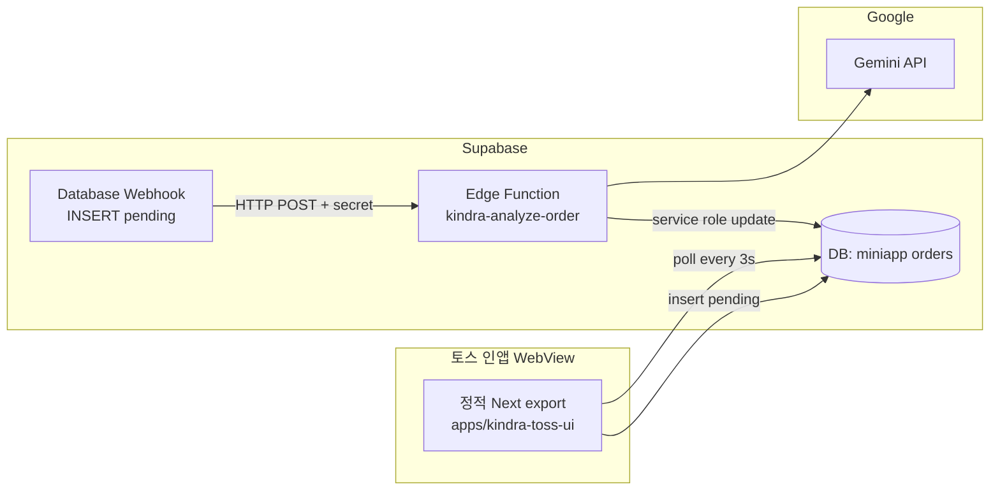

# 토스 미니앱(AIT) 모듈식 전환 — 브랜치 작업 계획

`main`은 웹 서비스(Next SSR·Server Actions·Vercel) 기준으로 유지하고, 아래 **전용 브랜치 + 전용 디렉터리**에서만 미니앱 규격 작업을 진행합니다. `dev1-prompts`의 프롬프트·AI 입출력 튜닝은 **`lib/gemini/*`를 단일 소스**로 두고, Edge 쪽에서는 **HTTP로 동일 로직을 복제·축약**하거나, 추후 **공유 패키지**(`packages/kindra-ai-core`)로 승격하는 것을 권장합니다.

## 브랜치 매핑

| 브랜치 | 목적 | 주요 경로 |
|--------|------|-----------|
| `main` | 기존 Kindra 웹 (변경 최소) | `app/`, `lib/gemini/`, `next.config.ts` |
| `dev1-prompts` | 프롬프트·멀티모달 스펙 | `lib/gemini/prompts.ts` 등 (현재) |
| **`dev1-backend`** | Supabase Edge + DB 웹훅 | `supabase/functions/kindra-analyze-order/`, `supabase/sql/proposed_miniapp_orders.sql` |
| **`dev1-toss-ui`** | 정적 번들 `.ait` 대비 UI | `apps/kindra-toss-ui/` (독립 `package.json`) |

## 목표 아키텍처 (요약)

- **클라이언트**: `output: 'export'` — API Routes·Server Actions 없음. `NEXT_PUBLIC_SUPABASE_*` 만으로 RLS/anon 정책에 맞는 읽기·쓰기.
- **백엔드**: Gemini·장시간 작업은 Edge Function. Vercel 10초 제한 회피, API 키는 Supabase Secrets에만 보관.
- **폴링**: 주문 행 `status`가 `pending` → `completed`로 바뀌면 UI가 결과(예: 오각형 점수 JSON 또는 마크다운)를 렌더.

## 단계별 바이브 코딩 가이드

### Phase A — `dev1-backend` 브랜치

1. **DB 스키마 (제안)**  
   - 파일: `supabase/sql/proposed_miniapp_orders.sql` (참고용, `db push` 전에 검토 후 마이그레이션으로 승격).  
   - 테이블 예: `kindra_miniapp_orders` (`id`, `status`, `email`, `consents jsonb`, `result jsonb`, `error text`, `created_at`, …).

2. **Edge Function 배치**  
   - `supabase/functions/kindra-analyze-order/index.ts`  
   - 로컬: `supabase functions serve kindra-analyze-order`  
   - 배포: `supabase functions deploy kindra-analyze-order --no-verify-jwt` (웹훅은 JWT 없음).

3. **Webhook 연동**  
   - Supabase Dashboard → **Database → Webhooks** → `kindra_miniapp_orders` **INSERT** 시 Edge URL 호출.  
   - 헤더에 `x-kindra-webhook-secret: <secret>` (Edge의 `KINDRA_WEBHOOK_SECRET`과 동일).  
   - 대안: `pg_net` + 트리거로 HTTP POST (문서화만 README에).

4. **Gemini 이식**  
   - 현재: `lib/gemini/generate.ts` + `lib/gemini/prompts.ts` (Node).  
   - Edge: Deno용 import(`esm.sh` / `npm:`)로 `@google/generative-ai` 호출. 프롬프트 문자열은 **복붙·축약** 또는 추후 **공유 모듈**로 추출.

### Phase B — `dev1-toss-ui` 브랜치

1. **디렉터리**: `apps/kindra-toss-ui/` — 루트 Next와 **별도** `package.json` (모노레포 workspaces 변경 없이도 동작).

2. **설정**: `apps/kindra-toss-ui/next.config.mjs` — `output: 'export'`, `images.unoptimized: true`.

3. **플로우 컴포넌트**  
   - `ConsentEmailStep` → `LoadingPollStep` (최소 45초 UX + 3초 폴링) → `ResultPentagonChart` (Recharts).

4. **AIT 번들**  
   - `next build` 산출물을 토스 파이프라인에 맞게 패키징 (파일명·메타는 토스 문서 따름).  
   - CORS: Supabase 프로젝트에 토스 WebView 오리진 허용.

### Phase C — `dev1-prompts`와 병합 시

- 프롬프트 변경은 `lib/gemini/prompts.ts` 한 곳을 진실로 두고, Edge는 배포 시 스크립트로 동기화하거나 패키지 의존으로 맞춤.

## 기존 코드와의 경계

- **수정 금지(원칙)**: 루트 `next.config.ts`, `app/actions/intake-submit.ts`, 기존 `supabase/migrations/*` 이력.  
- **추가만**: `supabase/functions/`, `supabase/sql/proposed_*.sql`, `apps/kindra-toss-ui/`, 본 문서.

## 추가된 파일 목록 (이번 작업)

| 경로 | 설명 |
|------|------|
| `docs/architecture/TOSS_MINIAPP_BRANCH_PLAN.md` | 브랜치·아키텍처·단계 가이드 (본 문서) |
| `supabase/sql/proposed_miniapp_orders.sql` | `kindra_miniapp_orders` 제안 스키마 + 웹훅 주석 |
| `supabase/functions/_shared/cors.ts` | Edge 공용 CORS/JSON 응답 헬퍼 |
| `supabase/functions/kindra-analyze-order/index.ts` | 주문 분석 Edge 보일러플레이트 |
| `supabase/functions/kindra-analyze-order/README.md` | 로컬·배포·시크릿 안내 |
| `apps/kindra-toss-ui/*` | 정적 Next 미니앱 패키지 (독립 `package.json`) |

## 환경 변수 체크리스트 (Edge)

| 변수 | 용도 |
|------|------|
| `SUPABASE_URL` | 자동 주입 가능 |
| `SUPABASE_SERVICE_ROLE_KEY` | 주문 업데이트·스토리지 읽기 |
| `GEMINI_API_KEY` | Gemini 호출 |
| `KINDRA_WEBHOOK_SECRET` | 웹훅 위조 방지 |

## 환경 변수 (토스 UI)

| 변수 | 용도 |
|------|------|
| `NEXT_PUBLIC_SUPABASE_URL` | 브라우저 클라이언트 |
| `NEXT_PUBLIC_SUPABASE_ANON_KEY` | RLS 하에 insert/select |
